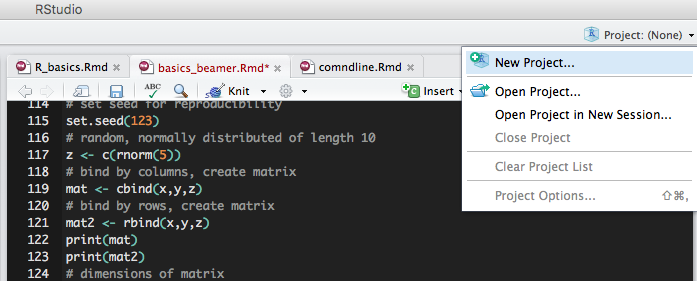

```{r setup, include=FALSE}
knitr::opts_chunk$set(echo = TRUE)
```

# R...
\colbegin
\column{.4\textwidth}

\column{.5\textwidth}

- statistical programming language
- helpful for making graphics
- helpful with *most* things bioinformatics

\colend

## Helpful websites

1. <http://www.r-tutor.com>

2. <https://www.r-bloggers.com>

3. <http://stackoverflow.com/documentation/r/topics> *This one is cool and new!!*

# RStudio

RStudio is a graphical interface for the R programming language. Essentially, it's a glorified R specific text editor, where you can run code directly. Your plots and history are all available, as well as debugging tools, and templates for many R Markdown documents.

*Note:* I am over simplifying the software...there are many more things you can do.

# R Studio

\Large
Let's take a tour of R studio....


# R Markdown

- This presentation in an R Markdown document
- This uses a very "simple" `LaTeX` alternative called `Markdown`
- You should write programming lab notebook in this kind of language
- This is super easy if you're writing in R or Python if you use R Studio
- We can go over this later if you are interested...

# Important and helpful R commands/functions

Let's go over some helpful commands that you will probably use everyday...


# R is a great calculator...

```{r}

(sqrt(62527) + (67*3275)) / 8.2
```

# Assign variables 

However, if you're doing calculations in R, you're probably going to want to save them as some variable...
```{r}

someNum <- (sqrt(62527) + (67*3275)) / 8.2
```

# Wait...what is `<-`?!?!

If you code in any other language, you'll notice one major difference in R...you can use both `<-`  and `=` to assign variables.

[Google's R style guide](https://google.github.io/styleguide/Rguide.xml) suggests you only use `<-`. [This blog post](http://blog.revolutionanalytics.com/2008/12/use-equals-or-arrow-for-assignment.html) has a good explanation why.

I'll leave it up to you to choose what you'd like to use. I use `<-`.

# Setting your working directory

\alert{Always} use a seperate working directory for each project.

RStudio makes this very easy!!!!!!


# Setting your working directory

You can also use R's `setwd()` function

```{r, eval=FALSE}

setwd("~/your/new/working/directory")

```

# Some commands...

```{r, eval=FALSE}
# You can comment your code by prepending
# the line with a number sign
x <- c(4,75,89,12, 9)
y <- c(1:5)
# set seed for reproducibility
set.seed(123)
# random, normally distributed of length 10
z <- c(rnorm(5)) 
# bind by columns, create matrix
mat <- cbind(x,y,z)
# bind by rows, create matrix
mat2 <- rbind(x,y,z)
print(mat)
print(mat2)
# dimensions of matrix
dim(mat)
```

# Some more commands...

```{r, eval=FALSE}
print(mat)
print(mat2)
# dimensions of matrix
dim(mat)
# get column 2
mat[,2]
# get row 3
mat[3,]
## You can also use boolean operators for 
## grabbing indice (TRUE/FALSE)
newDF <- data.frame(hello=x, weird=y,
  fun=c("one", "two", "three", "four", "five"))
print(newDF)
which(newDF < 1)
which(newDF$hello == 89)
```

# Class and structure of data

Some functions only work on variables with a certain structure and/or class

```{r, eval=FALSE}
str(mat) # gives structure information
class(mat) # gives class information
dataNum <- as.numeric(mat) 
dataChar <- as.character(mat)
df <- as.data.frame(mat)
newMat <- as.matrix(newDF)
```


# Using data in R

There are 3 different ways you can use/find data in R

1. Use built-in datasets
2. Download them from the web
3. Import your own CSVs

# Using built-in datasets

```{r, eval=FALSE}
data(cars)
head(cars)
data(iris)
head(iris)
```

# Download from the web
\footnotesize
```{r}
library(data.table)
mydat <- fread('http://www.stats.ox.ac.uk/pub/datasets/csb/ch11b.dat')
head(mydat)
```

# Import your data
```{r, eval=FALSE}
data <- read.csv("data/funstuff.csv", 
                 row.names=1,header=FALSE)
# writing a csv is similar
write.csv(data, file="~/file/path/2/write/data.csv",
          sep=",")
```


# Installing/loading packages

There are 2 main locations for R packages that you'll be using: 

- [CRAN](https://cran.r-project.org)
- [Bioconductor](http://www.bioconductor.org). *Bioconductor is a repository for biological packages* 

```{r, eval=FALSE}
# Installing from CRAN
install.packages('ggplot2') #notice the quotes!
library(ggplot2) # notice NO quotes!

# Installing from Bioconductor
source("https://bioconductor.org/biocLite.R")
biocLite() # this installs/updates bioconductor
biocLite('WGCNA')
# this will install packages, notice the quotes
library(WGCNA)
```

# But what if you don't know how to use the packages...

R Packages come with PDFs and help files. The good packages come with full-blown tutorials. One of the best things about these help files is that, as long as you've installed the package, they are stored locally and do not require internet access. To access these files you can:

```{r, eval=FALSE}
library(ggplot2)
?ggplot
help(ggplot)
vignette("parallel")

## What if you need a function, but forget
## what package it's in?

??predict #"??"" searches R help files!
```

# Simple plots (without ggplot2)

R has great built-in plot functions...[examples](http://rstudio-pubs-static.s3.amazonaws.com/7953_4e3efd5b9415444ca065b1167862c349.html)

\footnotesize
```{r, cache=TRUE, fig.height=6}
data(iris)
plot(iris$Sepal.Length, iris$Sepal.Width)
```

# Simple plots (without ggplot2)
\footnotesize
```{r, cache=TRUE, fig.height=6}
data(iris)
plot(iris$Sepal.Length, iris$Sepal.Width, 
     pch=10, col=iris$Species,
     xlab = "Sepal length", ylab = "Sepal width")
```

# Simple plots (without ggplot2)
```{r, fig.height=6}
boxplot(iris[,1:4])
```

