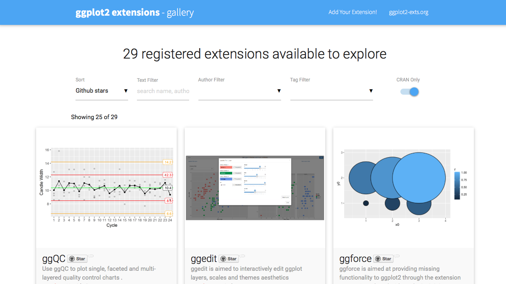

```{r setup, include=FALSE}
knitr::opts_chunk$set(echo = TRUE)
```

# ggplot2

``ggplot2 is a plotting system for R, based on the grammar of graphics, which tries to take the good parts of base and lattice graphics and none of the bad parts. It takes care of many of the fiddly details that make plotting a hassle (like drawing legends) as well as providing a powerful model of graphics that makes it easy to produce complex multi-layered graphics.'' -Hadley Whickam


# The `Grammer of Graphics'

ggplot2 was inspired by the grammer of graphics (hence the `gg' in ggplot2) by [Leeland Wilkinson](https://www.amazon.com/o/ASIN/0387245448/1.-20/).  
Wilkonson *et al.* describe a unique formula for creating and displaying information.

Note: I have not read this book...


# ggplot2 relies on the other `tidyverse' packages

The tidyverse can be found at <tidyverse.org>.  
Some other packages from the tidyverse you might find useful are:  
- [dplyr](http://dplyr.tidyverse.org)  
- [tidyr](http://tidyr.tidyverse.org)

But we are not here to learn the tidyverse or debate about how much we love and/or hate it...

# Free online tutorial

Datacamp offers its introduction to ggplot free!

[Click here](https://www.datacamp.com/courses/data-visualization-with-ggplot2-1)

# How do we reshape data?
\footnotesize
```{r, cache=T}
library(reshape2)
data("iris")
iris$sample.num <- rownames(iris)
reshapedIris <- melt(iris, id.vars = c("Species", "sample.num"))
```

# OK, how would we reshape this data?

```{r}
data("USArrests")
# first, get information on the dataset...how?
head(USArrests)
```

# Other useful ``reshape2'' commands...

You should look into:

1. `merge()`
2. `cast()`

# Before we start

This is is NO way a complete overview of ggplot2.  
This package can do WAY more, but hopefully it gives you an idea on how to start things off.  
There is a multitude of tutorials online, so there will always be help if needed :)

# OK, let's plot this data!
So that we're all on the same page...
\footnotesize
```{r, cache=T}
USArrests$state <- rownames(USArrests)
reshapedUS <- melt(USArrests, id.vars="state")
head(reshapedUS)
```

# Basic syntax of ggplot2
\footnotesize
```{r, eval=FALSE}
ggplot(data = yourdata, aes(x=?, y=?, fill = ?)) +
  # tells R that you want to make a plot using ggplot
  geom_line() + # what kind of plot you want
  theme() # where you change font size, colour, etc
```


# Histogram
\footnotesize
```{r, cache=TRUE, fig.height=5}
library(ggplot2)
murderArrest <- subset(reshapedUS, variable == "Murder")

ggplot(murderArrest, aes(x=value)) +
  geom_histogram(bins = 15)
```

# Barchart
\footnotesize
```{r, fig.height=6, cache=TRUE}

ggplot () + 
  geom_bar(data=murderArrest, aes(x=state, y= value), stat="identity")
```

# Barchart
\footnotesize
```{r, fig.height=6, cache=TRUE}
ggplot () + 
  geom_bar(data=subset(reshapedUS, variable == "Murder"), 
           aes(x=state, y= value), stat="identity") +
  theme(axis.text.x = element_text(angle = 45))
```

# So many options...

What if we wanted to:

- add an x axis label? y axis label?  
- plot "Murder"" and "Assult"  
- change the colours?  
- add % urban population in there too?  
- rotate the bar graph?  
- make a box plot?  

\centering
\LARGE WE CAN DO ALL OF THIS!!  
\tiny ...but should we?

# Murder and assault distribution
\footnotesize
```{r, fig.height=5.8, cache=TRUE}
ggplot(subset(reshapedUS, variable == c("Murder", "Assault")), 
       aes(x=value, colour = variable, fill = variable)) +
  geom_histogram(bins=50, position="identity") 
# try removing fill = variable
```

# Changing colours

- scale_fill_manual() : to use custom colors
- scale_fill_brewer() : to use color palettes from `RColorBrewer` package
- scale_fill_grey() : to use grey color palettes


# Changing colour example
\footnotesize
```{r, fig.height=4, cache=TRUE}
ggplot(subset(reshapedUS, variable == c("Murder", "Assault")), 
       aes(x=value, fill = variable)) +
  geom_histogram(bins=50, 
                 position="identity", colour = "black") +
 # scale_color_manual(values=c("#6d4057", "#ace5df")) +
  scale_fill_manual(values=c("#6d4057", "#ace5df"))
```


# Adding line graph to bar chart
\footnotesize
```{r, cache=TRUE, fig.height=5}
ggplot () + 
  geom_bar(data=subset(reshapedUS, variable == "Murder"), 
           aes(x= state, y= value), stat="identity") +
  geom_line(data = subset(reshapedUS, 
    variable == "UrbanPop"), aes(x=state, y=value, group=1)) +
  theme(axis.text.x = element_text(angle = 45))
```

# Stacked bar chart with all arrest types
\tiny
```{r, cache=TRUE, fig.height=6}
barchart <- ggplot () + 
  geom_bar(data=subset(reshapedUS, 
                       variable != "UrbanPop"), 
           aes(x= state, y= value, fill = variable),
           stat="identity") +
  theme(axis.text.x = element_text(angle = 45))
print(barchart)
```
# Flip the barchart 
\footnotesize
```{r, cache=TRUE, fig.height=7}

barchart + coord_flip()

```


# Change labels
\footnotesize
```{r, cache=TRUE, fig.height=6}
barchart +
  labs(x = "State", y = "# of arrests/100,000")

```

# Change legend title 

```{r, cache=TRUE, fig.height=6}
barchart + 
  guides(fill=guide_legend(title="Hello"))

```

# Change legend position and colours
\footnotesize
```{r, cache=TRUE, fig.height = 4}
# Position legend in graph, 
# where x,y is 0,0 (bottom left) 
# to 1,1 (top right)
barchart + 
  guides(fill=guide_legend(title="Hello")) +
  theme(legend.position=c(.5, .5)) +
  scale_color_manual(values=c("#6d4057", "#ace5df", "gold")) +
  scale_fill_manual(values=c("#6d4057", "#ace5df", "gold"))
```

# Box plots
\footnotesize
```{r, cache=TRUE, fig.height=6}
ggplot(data=subset(reshapedUS, variable != "UrbanPop"), 
       aes(x=variable, y=value)) +
   geom_boxplot(outlier.colour = "purple", outlier.shape=5)
```

# Facets
\footnotesize
```{r, cache=TRUE, fig.height=5}
ggplot(data=subset(reshapedUS, variable != "UrbanPop")) +
   geom_histogram(aes(x=value, colour = variable, 
                      fill=variable), bins=40) +
  facet_grid(~ variable)
```

# ggplot2 extensions

[website](http://www.ggplot2-exts.org)


# Literally so many things you can do...

```{r, echo=FALSE, cache=TRUE, fig.height=7, message=FALSE}
library(maps)
library(viridis)
crimes <- data.frame(state = tolower(rownames(USArrests)), USArrests)
crimesm <- reshape2::melt(crimes, id = 1)

states_map <- map_data("state")
ggplot(crimes, aes(map_id = state)) +
    geom_map(aes(fill = Murder), map = states_map) +
    expand_limits(x = states_map$long, y = states_map$lat) +
scale_fill_viridis(option="magma") + theme_bw()
```


\tiny  
[very much inspiried by this example](http://ggplot2.tidyverse.org/reference/geom_map.html)


# Code for the previous example
\tiny
```{r, eval=FALSE}
library(maps)
library(viridis)
crimes <- data.frame(state = tolower(rownames(USArrests)), USArrests)
crimesm <- reshape2::melt(crimes, id = 1)

states_map <- map_data("state")
ggplot(crimes, aes(map_id = state)) +
    geom_map(aes(fill = Murder), map = states_map) +
    expand_limits(x = states_map$long, y = states_map$lat) +
scale_fill_viridis(option="magma") + theme_bw()
```


# Another good tutorial

I was going to follow this tutorial, but then instead I decided to be more creative... Here it is anyway!!

[An Introduction on How to Make Beautiful Charts With R and ggplot2](http://minimaxir.com/2015/02/ggplot-tutorial/)  
By Max Woolfe